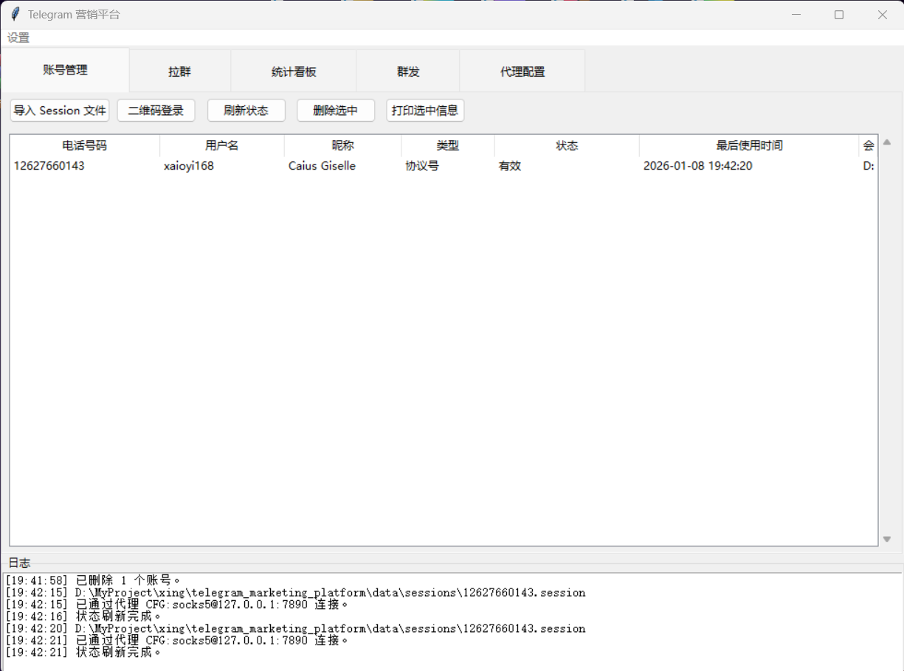
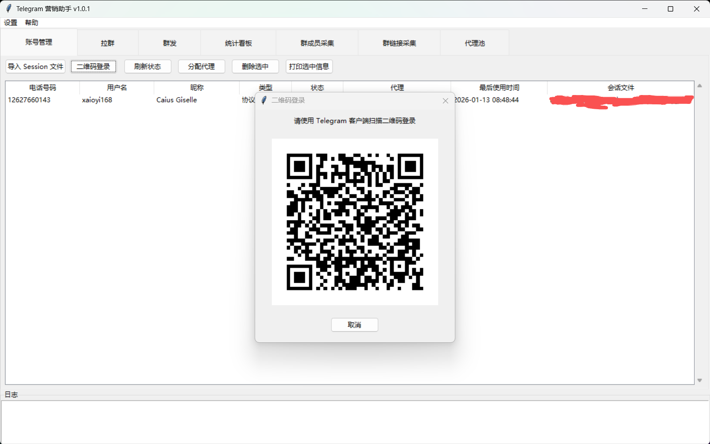
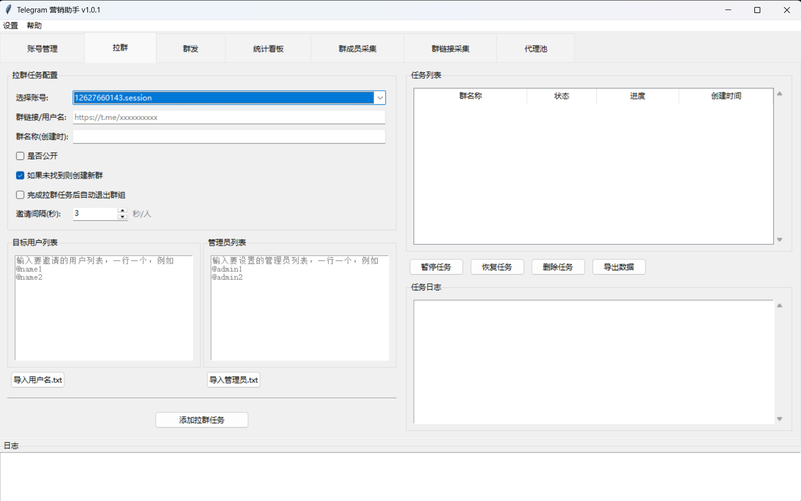
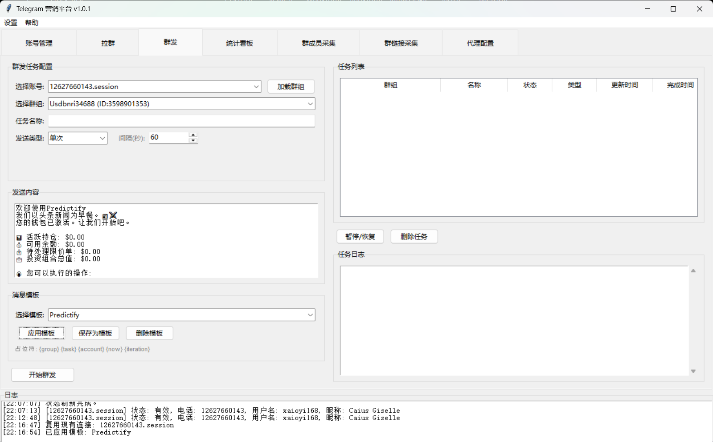
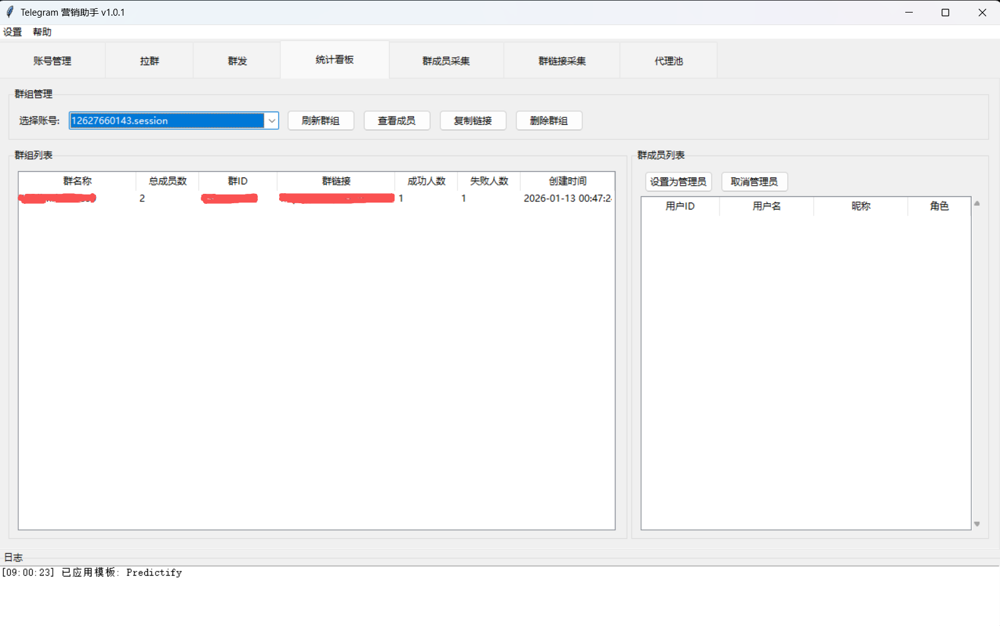
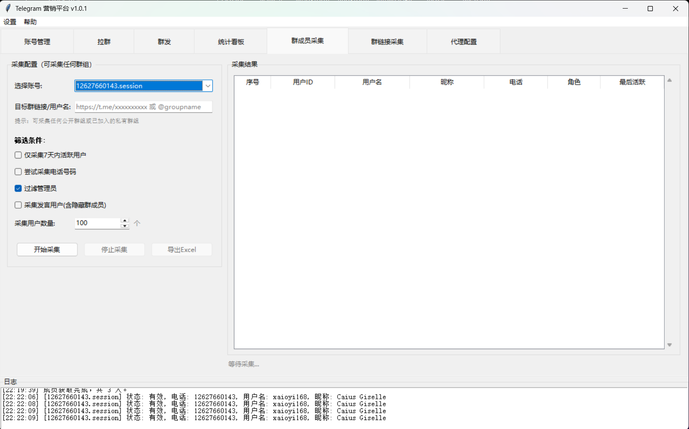
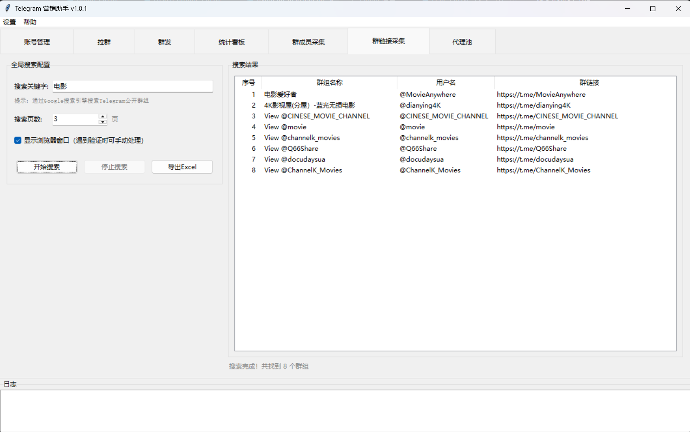
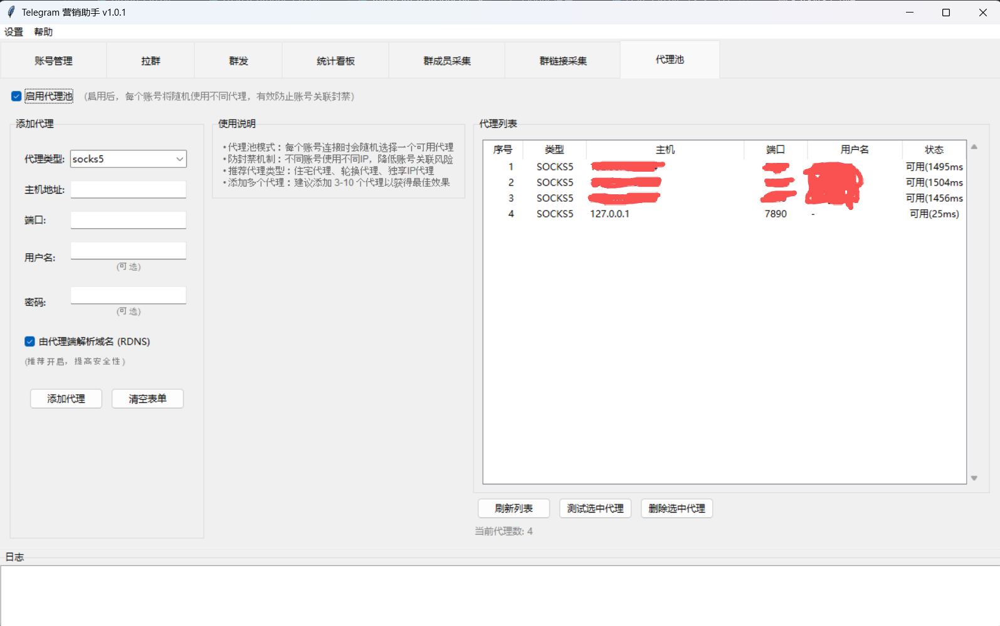
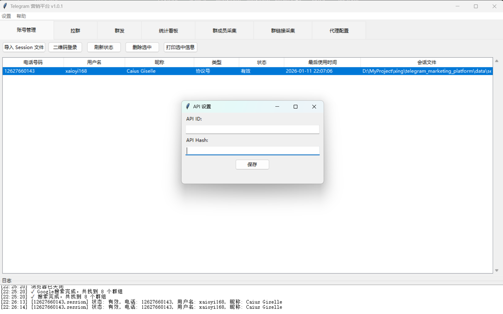
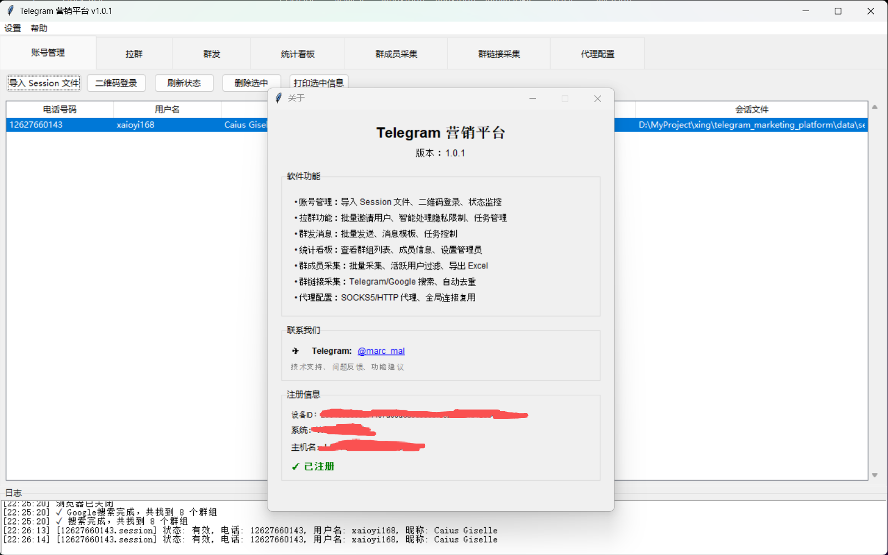

# Telegram电报群发拉群桌面版
Telegram电报群发拉群桌面版（飞机群发，TG群发）V1.0.1版本

• 账号管理：导入Session文件、二维码登录、状态监控、代理随机分配

• 代理池：代理池管理、SOCKS5/HTTP协议、代理测试、账号绑定

• 拉群功能：批量邀请用户、智能处理隐私限制、设置管理员、自动退群

• 群发消息：批量发送、消息模板、图片发送、循环/单次模式

• 统计看板：群组列表、成员查看、设置/取消管理员、删除群组

• 群成员采集：批量采集、活跃用户过滤、采集电话号、导出Excel

• 群链接采集：Telegram搜索、Google搜索、自动去重、右键复制

## 联系方式
- [Telegram](https://t.me/marc_mal)

# 程序截图

